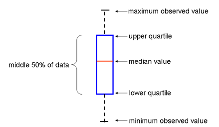

---
title: "Statistical Exploration of Climate Data"
author: 
- "Tamra Carpenter"
- "Jon Kettenring"
- "Robert Vanderbei"
- "Edited by Tyrel Winebarger, James Russell, Katrina Palmer, Kory Illenye"
date: '`r format(Sys.time(), "%b %d, %Y")`'
output: 
  ioslides_presentation:
    widescreen: true
---
<style>

body {
  background-color: #000029;
}

body p {
  color: blue;
  font-size: 15px;
}

body hgroup h2 {
  color: black;
}
.footer {
    color: White;
    background: Dodgerblue;
    position: fixed;
    top: 88%;
    text-align: center;
    width: 100%;
}

ul {
  display: block;
  font-size: 20px;
  margin-top: 0;
  margin-bottom: 0;
  margin-left: 0;
  margin-right: 0;
  font-weight: bold;
  color: blue;
}


slides > slide.title-slide {
    background-image: url(images/title.png);
    background-position: 50% 1%;
    background-attachment: local;
    background-repeat: no-repeat;
    background-size: 70% 60%;
    }
slides > slide.title-slide p {
  color: blue;
  font-size: 15px;
}


slides > slide.title-slide hgroup h1 {
  color: black;
  font-size: 40px;
  letter-spacing: 0;
}


slides > slide.{
  background: none !important;
  background-color: #444444 !important;
}

slides > slide.backdrop {
  background: white;
}
</style>

```{r setup, include=FALSE}
#Loads all required libraries and defines initial variables
require(lubridate)
require(shiny)
require(mosaic)
require(L1pack)
knitr::opts_chunk$set(echo = FALSE, comment = NA, prompt = TRUE, fig.align = "center")
#Load the data set
Raleigh <- read.csv("Raleigh.csv", header=FALSE)
Fairbanks <- read.csv("Fairbanks.csv", header=FALSE)
McGuireAFB <-read.csv("McGuireAFB.csv", header=FALSE)
NewOrleans <- read.csv("NewOrleans.csv", header=FALSE)

Fairbanks$V1 <- ymd(Fairbanks$V1)
McGuireAFB$V1 <- ymd(McGuireAFB$V1)
NewOrleans$V1 <- ymd(NewOrleans$V1)
Raleigh$V1<- ymd(Raleigh$V1)

#set up the years
nyears<- nrow(table(year(Raleigh$V1)))
years <- 1955:2010
years2 <- 1955:2009

#remove the leap days
NewOrleans <- subset(NewOrleans, (month(NewOrleans$V1)!=2 | day(NewOrleans$V1)!=29))
McGuireAFB <- subset(McGuireAFB, (month(McGuireAFB$V1)!=2 | day(McGuireAFB$V1)!=29))
Fairbanks <- subset(Fairbanks, (month(Fairbanks$V1)!=2 | day(Fairbanks$V1)!=29))
NewOrleans <- subset(NewOrleans, (year(NewOrleans$V1)!=2010))
McGuireAFB <- subset(McGuireAFB, (year(McGuireAFB$V1)!=2010))
Fairbanks <- subset(Fairbanks, (year(Fairbanks$V1)!= 2010))
Raleigh <- subset(Raleigh, (month(Raleigh$V1)!=2 | day(Raleigh$V1)!=29))
nobsR<- nrow(Raleigh)
nobsF<- nrow(Fairbanks)
nobsN<- nrow(NewOrleans)
nobsM<- nrow(McGuireAFB)

#format data into a matrix for Raleigh
temp.mat.Raleigh=matrix(0, nrow=365, ncol=nyears)
for(i in 1:nyears){
  temp.mat.Raleigh[1:365, i]<- Raleigh$V2[1:365+(i-1)*365]
}
colnames(temp.mat.Raleigh)<- years

#format data into a matrix for New Orleans
temp.mat.NewOrleans<- matrix(0, nrow=365, ncol=(nyears-1))
for(i in 1:(nyears-1)){
  temp.mat.NewOrleans[1:365, i]<- NewOrleans$V2[1:365+(i-1)*365]
}
colnames(temp.mat.NewOrleans)<- years2

#format data into a matrix for McGuireAFB
temp.mat.McGuireAFB<- matrix(0, nrow=365, ncol=(nyears-1))
for(i in 1:(nyears-1)){
  temp.mat.McGuireAFB[1:365, i]<- McGuireAFB$V2[1:365+(i-1)*365]
}
colnames(temp.mat.McGuireAFB)<- years2

#format data into a matrix for Fairbanks
temp.mat.Fairbanks<- matrix(0, nrow=365, ncol=(nyears-1))
for(i in 1:(nyears-1)){
  temp.mat.Fairbanks[1:365, i]<- Fairbanks$V2[1:365+(i-1)*365]
}
colnames(temp.mat.Fairbanks)<- years2

month.lengths <- c(31,28,31, 30,31,30,31,31,30,31,30,31)
month.ends<- c(1,cumsum(month.lengths))
```

## Yogi Berra says, “You can see a lot just by observing.” 

<H4><font color="blue">The data explored here examines daily average temperatures collected from January 1, 1955 to August 13, 2010 at weather stations located in Raleigh, McGuire Airforce Base, Fairbanks and New Orleans. These slides will walk you through multiple approaches for deciding how to analyze large data sets containing seasonality and high day-to-day variability.</font></H4>

## Has it gotten warmer at the four sites or not?

<H4><font color="blue">A good place to start is just plotting the data. Below are plots of the average daily temperatures (in degrees Fahrenheit) for all four locations. What do these plots indicate?</font></H4>

```{r, fig.cap="Figure 1: Plots of Average daily temperature"}
par(mfrow=c(2,2))
plot(1:nobsR, Raleigh$V2, xlab = "Observation", ylab = "Avg. Daily Temp (F)", main= "Raleigh", col= "blue", pch = 3)
plot(1:nobsM, McGuireAFB$V2, xlab = "Observation", ylab = "Avg. Daily Temp (F)", main = "McGuire Air Base", col= "blue",pch = 3)
plot(1:nobsN, NewOrleans$V2, xlab = "Observation", ylab = "Avg. Daily Temp (F)", main = "New Orleans", col= "blue", pch = 3)
plot(1:nobsF, Fairbanks$V2, xlab = "Observation", ylab = "Avg. Daily Temp (F)", main = "Fairbanks", col= "blue",pch = 3)
```

## Comparing Two different Years

<H4><font color="blue">The next slide has an applet that lets you change the years to compare the daily temperature between two years.  Can you find two years that would indicate tempuratures are rising?  Can you find two years that would indicate the tempuratures are falling?  Is one year obviously warmer or cooler than another? Or other observations?Discuss any observations.</font></H4>

## Comparing Two different Years


```{r}
knitr::include_app("https://winebargerjt.shinyapps.io/twoYear/", height = "300px")
```

<!-- What are some of the things that you see in this plot? (Is one year obviously warmer or cooler than another? Or other observations?) -->

## Review of Boxplots

<H4><font color="blue">**Boxplots** are one way to summarize data to get a sense of the overall distribution.</font></H4> <!-- They display the median, upper and lower quartiles, and maximum and minimum values of the data. The basic structure of a boxplot is shown here. The “box” is delimited by the upper and lower quartiles, and emanating from the box are “whiskers” to the extreme values in the data. The placement of the median within the box and the relative length of the whiskers give a sense of the spread and skewness (which describes asymmetry) in the data. -->

<center></center>

## Boxplots

<H4><font color="blue">The next slide has an applet that displays boxplots.  You can choose yearly, monthly or daily.  For example, if you choose yearly, this creates a boxplot for each year while if you choose monthly this creates 12 boxplot; one for each month.</font></H4><br><br>

<H4><font color="blue">Look at all three (yearly, monthly and daily) and discuss your observations.</font></H4>


## Boxplots

```{r}
knitr::include_app("https://winebargerjt.shinyapps.io/boxplots/", height = "300px")
```

## Seasonality

<H4><font color="blue">It can be difficult to see changes over time because of the seasonal effect.  One way to eliminate this is to plot the temperature for one day each year.  The next slide has an applet that lets you pick date and plots the temperture for that one date from 1955 to 2010.  The monthly option plots the average temperature for the month that you selected rather than the particular day.</font></H4> <br><br>

<H4><font color="blue">Pick a day in the winter and one in the summer.  What do you notice about the variablity?  Does this make sense?</font></H4><br><br>

<H4><font color="blue">Is there more or less variabilty between the daily and monthly option?  Why?</font></H4>

## Seasonality

```{r}
knitr::include_app("https://winebargerjt.shinyapps.io/twoDays/", height = "300px")
```

## Intro to time series

<H5><font color = "blue"> Another way to remove seasonality from data in a series through time is to compare points that should be the same with respect to seasonal effects. For instance, there should be no seasonal effect if you plot only the temperature readings taken on January 1 of each year or only those taken on August 17 - which you just played with. Let’s look for a more holistic approach.</font></H5> <br><br>

<!-- The temperature readings are a sequence of observations in time, or a **time series**. A characteristic property of a time series is that the observations are not independent over time. Seasonality is one example of this lack of independence – you would expect the temperature on August 17, 2010 to be more like the temperature on August 17, 1955, than to the temperature on February 15, 2010. A simple model of data in a time series is to view each observation as being the realization of a random variable made up of a trend through time, (one or more) seasonal effects, and remaining effects that are not a function of time. -->

<H6><font color = "blue">The temperature data has a seasonal component with a period of 365 days. Letting $T_t$ denote the temperature reading at time $t$, the following differences remove the seasonal component: </font></H6><br><br>

$$\LARGE D_t = T_t - T_{t-365}$$

<!-- These differences are plotted in here. The red line through the plot just shows the zero value. -->


## Time Series

<H4><font color = "blue"> Does it make sense that the red line is close to 0? If there were a linear trend in temperature, then the differences should be randomly distributed about the average yearly change.</font></H4>

```{r}
TNewOrleans <- cbind(1:length(NewOrleans[,1]),NewOrleans)
TRaleigh <- cbind(1:length(Raleigh[,1]),Raleigh)
TMcGuireAFB <- cbind(1:length(McGuireAFB[,1]),McGuireAFB)
TFairbanks <- cbind(1:length(Fairbanks[,1]),Fairbanks)

PNewOrleans <- numeric(365)
PRaleigh <- numeric(365)
PMcGuireAFB <- numeric(365)
PFairbanks <- numeric(365)
for (i in 1:365){
  PNewOrleans[i] <- TNewOrleans$V2[i+365] - TNewOrleans$V2[i]
  PRaleigh[i] <- TRaleigh$V2[i+365] - TRaleigh$V2[i]
  PMcGuireAFB[i] <- TMcGuireAFB$V2[i+365] - TMcGuireAFB$V2[i]
  PFairbanks[i] <- TFairbanks$V2[i+365] - TFairbanks$V2[i]
}
P <- cbind(1:365,PNewOrleans)
P2 <- cbind(1:365,PRaleigh)
P3 <- cbind(1:365,PMcGuireAFB)
P4 <- cbind(1:365,PFairbanks)
par(mfrow=c(2,2))
plot (P, xlab = "Day of the Year", ylab = "Difference in Temp.", main= "New Orleans", col= "blue", pch = 3)
abline(h=0, col = "red")
plot (P2, xlab = "Day of the Year", ylab = "Difference in Temp.", main= "Raleigh", col= "blue", pch = 3)
abline(h=0, col = "red")
plot (P3, xlab = "Day of the Year", ylab = "Difference in Temp.", main= "McGuire AFB", col= "blue", pch = 3)
abline(h=0, col = "red")
plot (P4, xlab = "Day of the Year", ylab = "Difference in Temp.", main= "Fairbanks", col= "blue", pch = 3)
abline(h=0, col = "red")
```

<!-- - Do you see evidence of a trend in Figure 5?
- Why might you not be able to see a trend in Figure 5, even if one exists? -->

## Average Temperatures

<H3><font color = "blue">We are searching for a small signal (in this case a temperature change), if any, within data that are very noisy (due to day to day variations). One way to smooth out some of this variability is to use averaging. The next app plots yearly average temperature over time. </font><H3> 


## Average Temperatures

```{r}
knitr::include_app("https://winebargerjt.shinyapps.io/annualAVG/", height = "300px")
```

## Final Discussions

<font color ="blue">

1. <H4><font color ="blue">Do you think you have a better sense for the data now than you did at the beginning? Explain. </font></H4><br><br>

2. <H4><font color ="blue"> What questions about the data might you want to ask next? </font></H4><br><br>

3. <H4><font color ="blue"> What other plots would you suggest looking at?  Why? </font></H4>

</font>


## Final Project Possibilities

<font color ="blue">

1. <H4><font color ="blue">The module has not answered the question we began with: “Is there any observable temperature trend over this time period at the four locations?” What do you think? Support your position with evidence from the graphs.</font></H4> <br><br>
2. <H4><font color ="blue">Compare two of the four locations.  How are they the same and how are they different?</font></H4>

</font>

## References

<font color ="black">

1. <H4><font color ="black">J. M. Chambers, W. S. Cleveland, B. Kleiner, and P. Tukey, “Graphical Methods for Data Analysis,” Duxbury Press, Boston, MA, 1983.</font></H4>
2. <H4><font color ="black"> M. Frigge, D. C. Hoaglin, B. Iglewicz, “Some Implementations of the Boxplot,” *The American Statistician*, **43**(1), pp. 50-54, 1989.</font></H4>
3. <H4><font color ="black">R.J. Hyndman and Y. Fan, “Sample Quantiles in Statistical Packages,” *The American Statistician*, **50**(4), pp. 361-365, 1996.</font></H4>
4.  <H4><font color ="black">R. McGill, J. W. Tukey and W. A. Larsen, “Variations of Boxplots,” *The American Statistician*, **32**(1), pp. 12-16, 1978.</font></H4>
5. <H4><font color ="black">NOAA, Climate data format and download instruction, 2011.  ftp://ftp.ncdc.noaa.gov/pub/data/gsod/readme.txt.</font></H4>
6. <H4><font color ="black">NOAA, Data Tables, Normal Daily Mean Temperature, Degrees F,  http://www1.ncdc.noaa.gov/pub/data/ccd-data/nrmavg.txt.</font></H4>

</font>
